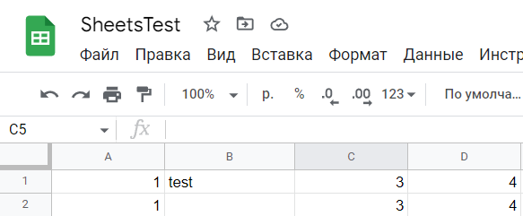

# Test_Google_Sheets_API.

Для запуска тестов добавьте в tests файл авторизации сервисного аккаунта tests-358414-baea7a149cfb.json

Команда

```
pytest
```

-------

## Для создания allure отчета

```
pytest --alluredir results
allure serve results
```

-------

## Баг репорт

### ID: 001

### Метод SpreadsheetAPI.insert возвращает None (test_09)

### Cценарий:

1.Сделать вставку в таблицу



Ожидаемый результат: SpreadsheetAPI.insert возвращает True

Фактический результат: SpreadsheetAPI.insert возвращает None

### Предложение по улучшению

### ID: 001

### Метод get_range возвращает None (test_09)

### Cценарий:

1. Передать пустые параметры в функцию get_range (get_range(None, None, None))

Ожидаемый результат: Возвращает "A1:Z1000"

Фактический результат: Возвращает None 

При этом API работает получая в качесвтве _range None и сама устанавливает его на default.

